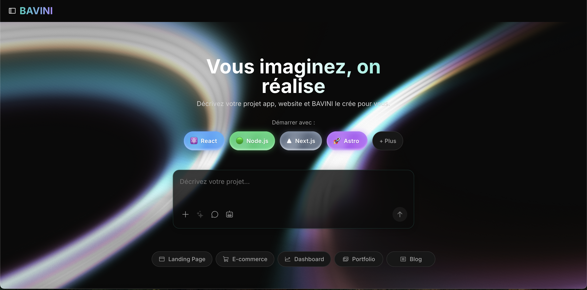

<div align="center">

# BAVINI

**Environnement de développement web propulsé par l'IA**

[](./LICENSE.md)
[](https://nodejs.org/)
[](https://www.typescriptlang.org/)
[](https://reactjs.org/)

[Démarrage rapide](#démarrage-rapide) • [Fonctionnalités](#fonctionnalités) • [Documentation](#documentation) • [Stack technique](#stack-technique)

</div>

---

## À propos

BAVINI est un agent de développement web IA qui permet de concevoir, exécuter, modifier et déployer des applications full-stack directement depuis le navigateur. Il intègre un système multi-agents sophistiqué pour gérer des tâches de développement complexes.



---

## Démarrage rapide

```bash
# Cloner le repository
git clone https://github.com/roblucci9302/BAVINI.git
cd BAVINI

# Installer les dépendances
pnpm install

# Configurer l'environnement
cp .env.example .env.local
# Ajouter votre clé API Anthropic dans .env.local

# Lancer le serveur de développement
pnpm dev
```

Ouvrir [http://localhost:5173](http://localhost:5173) dans votre navigateur.

---

## Fonctionnalités

### Développement Full-Stack dans le navigateur

Environnement de développement complet propulsé par WebContainers :

- Installation et exécution de packages npm (Vite, Next.js, React, etc.)
- Serveurs Node.js directement dans le navigateur
- Interaction avec des APIs tierces
- Déploiement en production depuis le chat

### Système Multi-Agents

8 agents IA spécialisés travaillant en coordination :

| Agent | Rôle |
|-------|------|
| **Orchestrator** | Analyse des tâches et coordination |
| **Explorer** | Analyse de code et exploration |
| **Coder** | Génération et modification de code |
| **Builder** | Build system et opérations npm |
| **Tester** | Exécution et analyse des tests |
| **Deployer** | Opérations Git et déploiement |
| **Reviewer** | Qualité et revue de code |
| **Fixer** | Détection et correction de bugs |

### Contrôle complet de l'environnement

- Opérations sur le système de fichiers
- Terminal et commandes shell
- Gestion des packages
- Intégration console navigateur

### Prévisualisation

- Simulation d'appareils (Desktop / Tablette / Mobile)
- Mode plein écran
- Support multi-ports

### Persistance

- Historique de chat avec checkpoints
- Récupération d'état via base de données PGlite
- Sauvegarde automatique

---

## Documentation

| Document | Description |
|----------|-------------|
| [Architecture technique](./BAVINI.md) | Architecture complète du projet |
| [Guide de développement](./GUIDE_BONNES_PRATIQUES_DEVELOPPEMENT.md) | Bonnes pratiques de développement |
| [Contribution](./CONTRIBUTING.md) | Guide de contribution |
| [API Reference](./docs/API.md) | Documentation de l'API |

---

## Stack technique

| Catégorie | Technologies |
|-----------|--------------|
| **Frontend** | React 18, Remix, TypeScript |
| **Styling** | UnoCSS, Radix UI |
| **Éditeur** | CodeMirror 6 |
| **State** | Nanostores |
| **IA** | Anthropic Claude API |
| **Runtime** | WebContainers API |
| **Base de données** | PGlite (SQLite in browser) |
| **Tests** | Vitest, Testing Library, Playwright |
| **Déploiement** | Cloudflare Pages |

---

## Développement

### Prérequis

- Node.js >= 18.18.0
- pnpm >= 9.4.0

### Commandes

| Commande | Description |
|----------|-------------|
| `pnpm dev` | Serveur de développement |
| `pnpm build` | Build de production |
| `pnpm start` | Serveur de production local |
| `pnpm deploy` | Déploiement Cloudflare Pages |
| `pnpm test` | Tests unitaires |
| `pnpm test:watch` | Tests en mode watch |
| `pnpm lint` | Lint ESLint |
| `pnpm typecheck` | Vérification TypeScript |

### Structure du projet

```
app/
├── components/        # Composants React UI
│   ├── chat/          # Interface de chat
│   ├── editor/        # Éditeur de code
│   ├── workbench/     # Espace de travail IDE
│   └── ui/            # Primitives réutilisables
├── lib/
│   ├── agents/        # Système multi-agents
│   ├── stores/        # État Nanostores
│   ├── hooks/         # React hooks
│   ├── persistence/   # Couche base de données
│   └── services/      # Intégrations externes
├── routes/            # Routes API Remix
└── utils/             # Fonctions utilitaires
```

---

## Conseils d'utilisation

- **Soyez spécifique** — Mentionnez les frameworks et librairies dans vos prompts
- **Utilisez l'amélioration** — Cliquez sur l'icône enhance pour affiner vos prompts
- **Structurez d'abord** — Mettez en place la structure de base avant les fonctionnalités avancées
- **Groupez les instructions** — Combinez les tâches simples pour gagner du temps

---

## Crédits

Basé sur [Bolt.new](https://github.com/stackblitz/bolt.new) par StackBlitz.

---

## Licence

**Licence Propriétaire** — Copyright © 2025 Robes-pierre Ganro

Ce logiciel est sous licence propriétaire. Voir [LICENSE.md](./LICENSE.md) pour les conditions complètes.

Les portions de code dérivées de Bolt.new restent sous licence MIT. Voir [THIRD_PARTY_LICENSES.md](./THIRD_PARTY_LICENSES.md) pour les attributions.
